# Get Fit

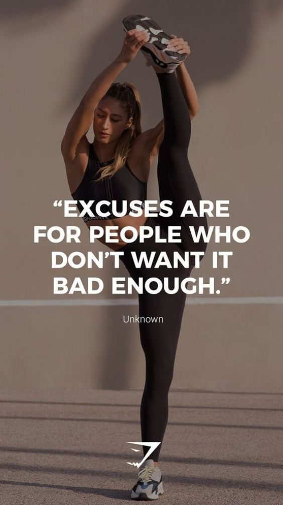

## About
Best place for men and women aiming to loose weight, gain muscles, and get fit in short time. You can organize your plan by choosing the type of the diet you want to follow, the products you want to consume, and the workouts you want to practice.
- This app is developed for General Assembly and MISK's Software Engineering Immersive Boot-camp's final project.
- This web app was developed by the Fantastic-4 team.
#### Team Members
- Razan Sannan
- Dalia Dammas
- Hatim Alattas
- Abdullah Alshahrani
## Plane
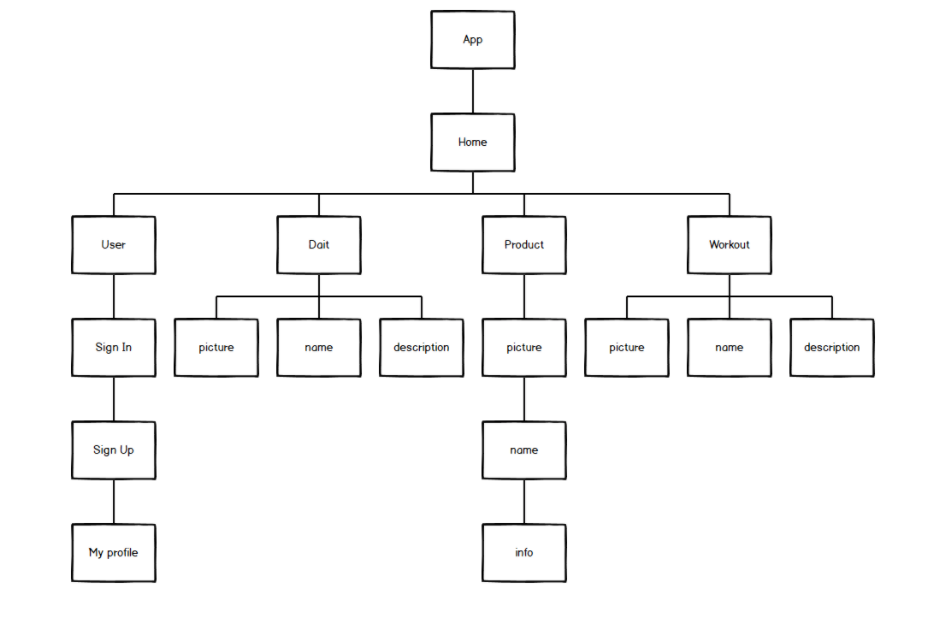

## Wireframe
HOME

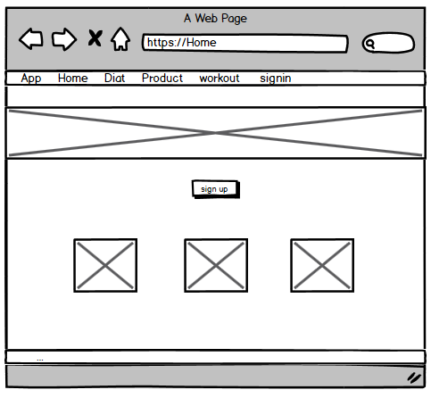
WORKOUT

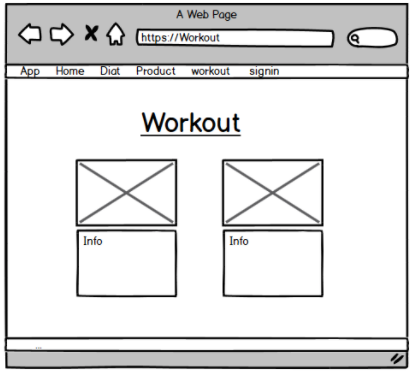
DIET

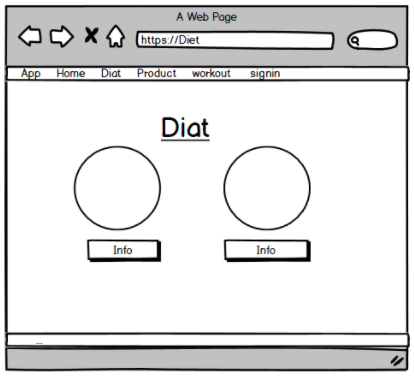
PRODUCT

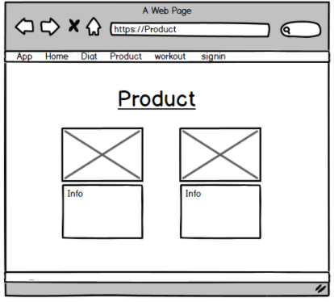
USER

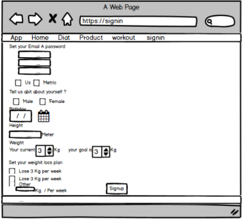
MACRO CALCULATER

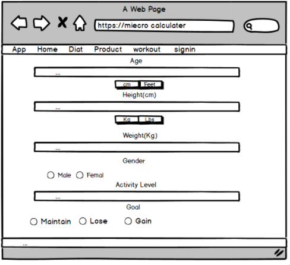

## Website Screenshots
HOME
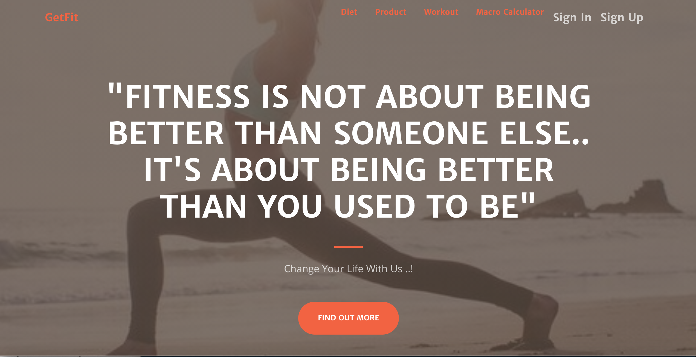
Service
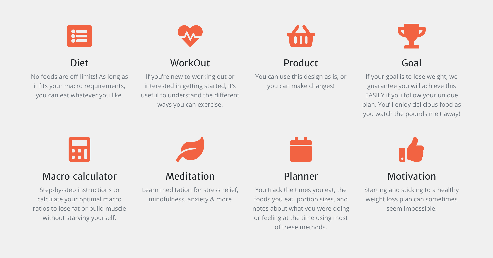
WORKOUT
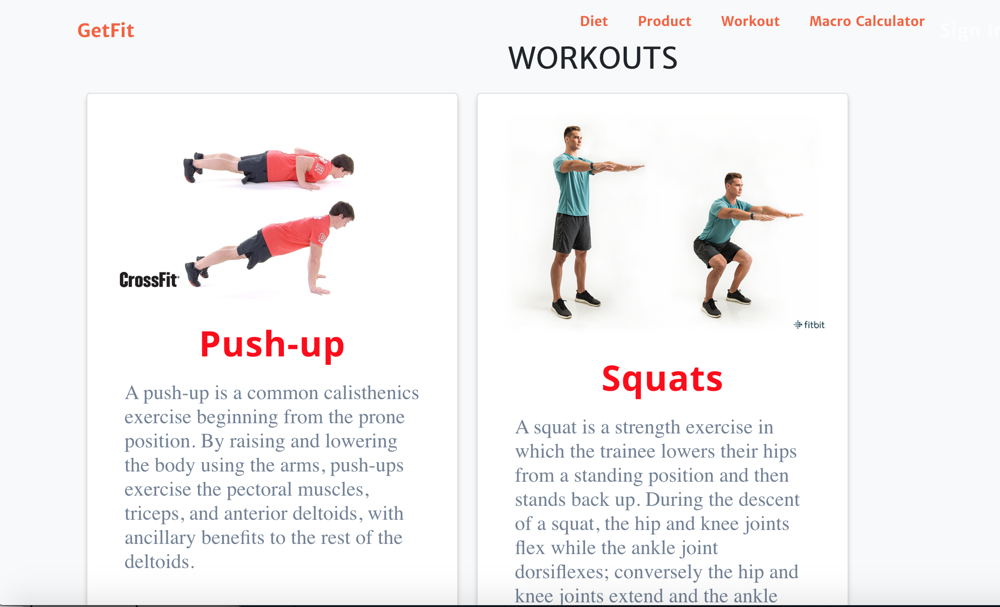
DIET
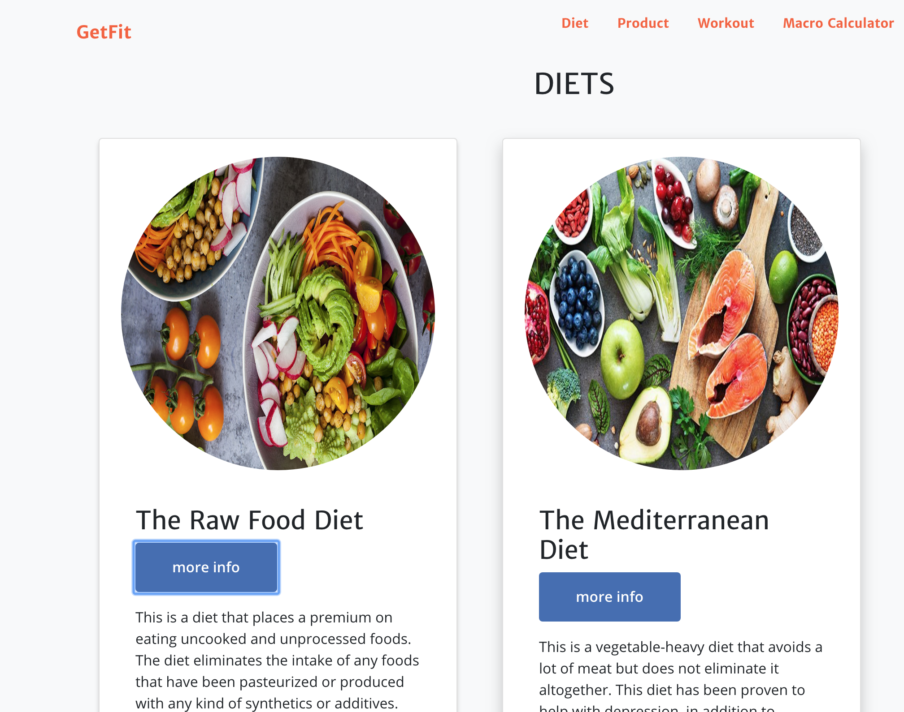
PRODUCT
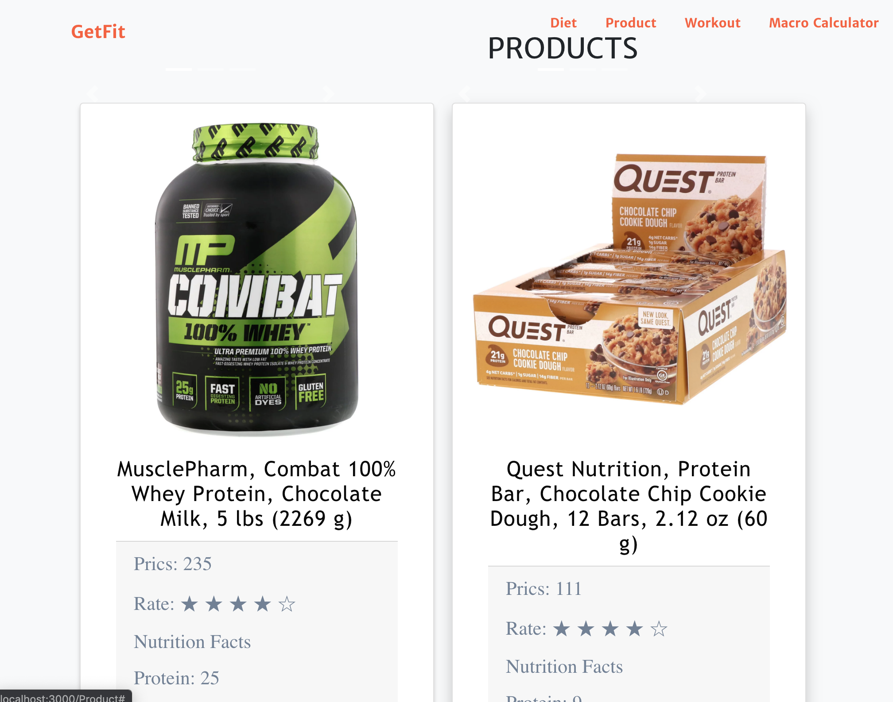
MACRO CALCULATER
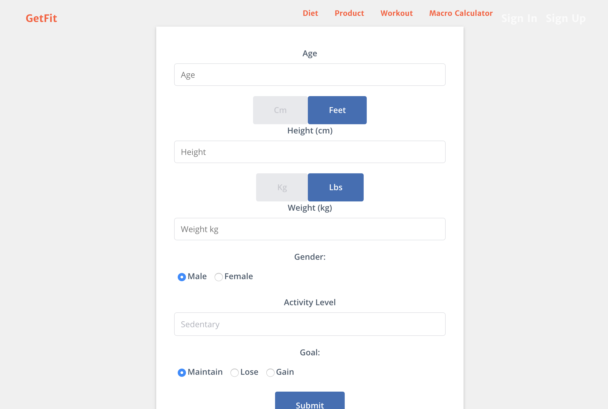

## App Features
- Ability to Signup, Signin
- Ability to Create, Read, Update, and Delete Workouts, Diets, Products, and Goals
- Ability to calculate calorie intake

## Technologies Used
- Command Line: Used to interact with the computer
- Balsamiq Mockups: Used for building the wireframe
- Visual Studio Code: Used for writing the codes
- HTML: Front-end
- CSS: Front-end
- JavaScript: Front-end
- React.js: Front-end
- Bootstrap: Front-end
- Axios: Used to handling APIs
- Ruby on Rails: Back-end
- MySQL: Database
- Express.js: Back-end
- MongoDB: Database
- Git & GitHub: Version control and team sharing
## Requirements Met
- Built full-stack web application
- Components
- Have full CRUD methods
- Routes
- Devise
## Deleverables
- README file that explain the app features
- Presentation
- GitHup Deploy Link
- FrontEnd 
https://github.com/Razan-1996/GetFit-FrontEnd
- BackEnd
Express:
https://github.com/hatimalattas/GetFit_Backend
Rails:
